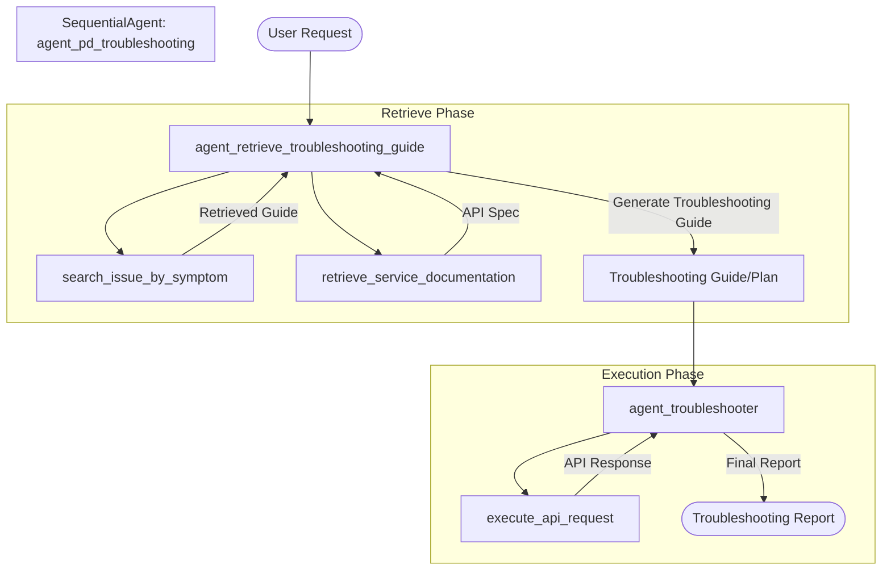

# Agent PD Troubleshooting

This agent system is designed to automate the troubleshooting process for the `dummy-fastapi-service`. It follows a sequential process:

1.  **Retrieve Troubleshooting Guide**: The first agent, `agent_retrieve_troubleshooting_guide`, analyzes the user's issue, searches for a matching guide in a mock troubleshooting library, and retrieves the API documentation for the relevant service.
2.  **Troubleshoot**: The second agent, `agent_troubleshooter`, takes the generated troubleshooting plan and executes the necessary API calls to diagnose and resolve the issue.

## Workflow Diagram



## Components

-   **`agent_retrieve_troubleshooting_guide`**: 
    -   Analyzes user issue.
    -   Uses `search_issue_by_symptom` to find pre-defined guides.
    -   Uses `retrieve_service_documentation` to get API specs.
    -   Generates a tailored troubleshooting plan.
-   **`agent_troubleshooter`**: 
    -   Executes the plan step-by-step.
    -   Uses `execute_api_request` to interact with the service.
    -   Reports process and results.
-   **`agent_pd_troubleshooting`**: A `SequentialAgent` that orchestrates the workflow from retrieval to execution.

## Example Usage

**User Issue**: "Bob cannot join swim team."

The system will:
1.  Find the guide for "one user cannot join a team".
2.  Retrieve API specs for users and teams.
3.  Generate a plan to check user existence, team existence, and habit matching.

Example `troubleshooting_guide` output:

```markdown
# troubleshooting_guide 
## Issue: One user cannot join a team (Bob cannot join swim team) 

### 1. Verify User Existence
- **Action**: Retrieve the list of all users to find "Bob".
- **API Call**: `GET /users`
- **Check**: Look for a user with `name: "Bob"`. Note his `id` and `habits`.
- **If not found**: The user "Bob" does not exist in the system.

### 2. Verify Team Existence
- **Action**: Retrieve the list of all teams to find the "swim team".
- **API Call**: `GET /teams`
- **Check**: Look for a team with `name: "swim"` or similar.
- **If not found**: The team "swim" does not exist.

### 3. Check Habit Compatibility
- **Action**: Compare Bob's habits with the team's requirements.
- **Check**: Review the `habits` array for Bob (from Step 1). For a "swim" team, the user likely needs a habit like "swimming".
- **If habits don't match**: This is likely why the user cannot join.

### 4. Attempt Manual Addition and Check Error
- **Action**: Try to manually add Bob to the swim team to see the specific error response.
- **API Call**: `POST /teams/{team_name}/users/{user_id}`
- **Parameters**: Use the `team_name` found in Step 2 and the `user_id` found in Step 1.
- **Analysis**: If the request fails with a `422` or other error, the response body will provide more details on the validation failure.
```

4.  Execute API calls to verify these conditions.
5.  Report the findings.

Example `troubleshooting_report` output:

```markdown
# Troubleshooting Report: Bob Cannot Join Swim Team

## Summary
I have completed the troubleshooting process for why Bob cannot join the swim team. Below is the detailed report.

## Detailed Steps

### 1. Verify User Existence
- **Action**: Called `GET /users` to locate Bob.
- **Result**: Found user **Bob Jones** with `id: 2`.
- **Observation**: Bob's registered habits are `["sing"]`.

### 2. Verify Team Existence
- **Action**: Called `GET /teams` to locate the swim team.
- **Result**: Found a team named **"swim"**.

### 3. Check Habit Compatibility
- **Analysis**: Bob's only habit is "sing". The team he is trying to join is "swim". There is a clear mismatch between the user's habits and the team's purpose.

### 4. Attempt Manual Addition and Validation
- **Action**: Attempted to manually add Bob (`id: 2`) to the "swim" team using `POST /teams/swim/users/2`.
- **Result**: The request failed with a **400 Bad Request** error.
- **Verification**: To confirm if habits are the limiting factor, I attempted to add **Alice Smith** (`id: 1`), who has the habit "swim", to the "swim" team.
- **Verification Result**: The request was **successful**, and Alice was added to the team.

## Final Conclusion
Bob cannot join the "swim" team because he does not have the required **"swim"** habit. The system enforces a requirement where a user's habits must match the team they are joining.

## Recommended Resolution
To allow Bob to join the team, his user profile should be updated to include "swim" in his habits list. This can be done via the `PUT /users/2` endpoint.
```
