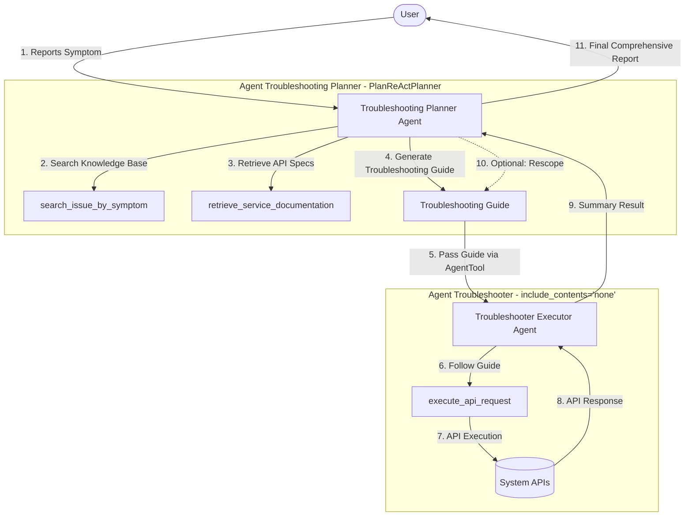

# Agent Progressive Disclosure Troubleshooting

This project demonstrates a multi-agent troubleshooting system built using the **Google Agent Development Kit (ADK)**. It showcases how to use advanced planning, progressive disclosure, and delegation to solve complex system issues in a safe and structured manner.

## Key Concepts

### 1. ReAct Planner (`PlanReActPlanner`)
The `agent_troubleshooting_planner` utilizes the `PlanReActPlanner` to manage the troubleshooting lifecycle:
- **Analyze & Retrieve**: Based on the user's question, it retrieves relevant context (troubleshooting guides and API specs).
- **Plan**: It generates a specific troubleshooting guide tailored to the current issue.
- **Execute & Rescope**: It sends the guide to the executor agent. Based on the feedback received from the executor, the planner can rescope the next steps or finalize the report.

### 2. Progressive Disclosure
This architectural pattern ensures that agents only receive the information they need for their specific task:
- The Planner acts as a filter, only sending the **relevant context** and instructions to the executor agent.
- No unnecessary information or unrelated system state is shared, reducing noise and increasing the executor's accuracy.

### 3. AgentTool (Execution Isolation)
The `agent_troubleshooter` is wrapped in an `AgentTool` and provided to the planner.
- **Isolation**: It isolates the detailed execution information (individual API calls, raw logs) within the executor agent.
- **Abstraction**: Only the final result or high-level feedback is sent back to the Planner.
- **Efficiency**: The detailed execution information is "forgotten" by the planner, keeping the planner's context clean and focused on high-level strategy.

### 4. `include_contents="none"` (Context Optimization)
The executor agent is configured with `include_contents="none"`.
- **Stateless Focus**: This prevents the agent from sending previous conversation history to the LLM.
- **Specialization**: It forces the executor agent to focus exclusively on the troubleshooting guide currently generated by the planner, preventing historical context from interfering with the specific execution task.

### 5. `temperature=0.0` (Deterministic Output)
Both agents use `GenerateContentConfig(temperature=0.0)`.
- **Precision**: This forces the LLM to be deterministic and avoid "guessing."
- **Safety**: In troubleshooting, it is critical that the agent follows instructions exactly and reports only what it observes through tool calls.

## Project Architecture

The system consists of two specialized agents:

1.  **Troubleshooting Planner (`agent_troubleshooting_planner`)**:
    - **Role**: Senior Expert Planner using **ReAct Planner**.
    - **Tools**: `search_issue_by_symptom` (Mock VectorDB), `retrieve_service_documentation` (API Specs), and the `agent_troubleshooter` (via `AgentTool`).
    - **Workflow**: Analyzes symptoms, retrieves documentation, and **generates a detailed troubleshooting guide**. It then **passes this guide** to the `agent_troubleshooter` via the `AgentTool`. It remains in a loop (ReAct) to rescope or finalize based on the executor's feedback.

2.  **Troubleshooter Executor (`agent_troubleshooter`)**:
    - **Role**: Execution specialist utilizing **Progressive Disclosure**.
    - **Configuration**: Uses `include_contents="none"` to ensure a stateless focus on the planner's guide.
    - **Tools**: `execute_api_request`.
    - **Workflow**: Receives only the relevant troubleshooting guide and API specs from the planner. It executes the necessary API calls and provides a high-level summary back, while detailed execution context is isolated and abstracted away from the planner.

## How it Works

The system follows a structured diagnostic process, as illustrated by this example:

**Example Scenario**: A user reports, *"Bob cannot join the swim team."*

1.  **User Report**: The user provides the symptom: *"Bob cannot join the swim team."*
2.  **Retrieval (Progressive Disclosure)**: The Planner agent searches for relevant troubleshooting guides (e.g., "one user cannot join a team") and retrieves the necessary API specifications for user and team services.
3.  **Planning (ReAct)**: The Planner generates a tailored troubleshooting guide:
    - Step 1: Verify if user 'Bob' exists.
    - Step 2: Verify if 'swim team' exists.
    - Step 3: Check if Bob's habits match the swim team requirements.
4.  **Delegation (AgentTool)**: The Planner delegates these steps to the Troubleshooter Executor, passing only the guide and the relevant API context.
5.  **Execution (Isolation)**: The Troubleshooter follows the guide, makes the actual `GET` requests to the system APIs, and observes the responses. Detailed API logs are kept internal to the executor.
6.  **Feedback & Rescoping**: The Troubleshooter returns a high-level summary (e.g., *"User exists, team exists, but habit mismatch found"*). If needed, the Planner can rescope and ask for further checks.
7.  **Resolution**: The system returns a final, comprehensive report to the user explaining why Bob cannot join the team.
