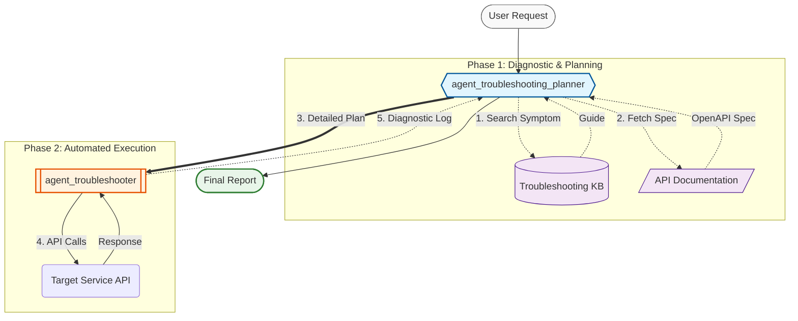

# Agent PD Troubleshooting

This agent system is designed to automate the troubleshooting process for the `dummy-fastapi-service`. It follows a sequential process:

1.  **Retrieve Troubleshooting Guide**: The first agent, `agent_troubleshooting_planner`, analyzes the user's issue, searches for a matching guide in a mock troubleshooting library, and retrieves the API documentation for the relevant service.
2.  **Troubleshoot**: The second agent, `agent_troubleshooter`, takes the generated troubleshooting plan and executes the necessary API calls to diagnose and resolve the issue.

## Workflow Diagram



## Components

### 1. Troubleshooting Planner (`agent_troubleshooting_planner`)

The **Troubleshooting Planner** is a senior-level expert responsible for the initial diagnostic and planning phase. It operates under a strict **READ-ONLY Policy** to ensure system stability during investigation.

-   **Role**: Analyzes the user's reported symptom and constructs a safe, step-by-step execution plan.
-   **Key Tools**:
    -   `search_issue_by_symptom`: Simulates a semantic search against a Vector Database to find relevant historical troubleshooting guides.
    -   `retrieve_service_documentation`: Fetches the live OpenAPI specification to understand the current API contracts.
    -   `agent_troubleshooter`: Once a plan is formulated, the planner delegates the execution to this agent.
-   **Capabilities**: It uses a `PlanReActPlanner` to handle complex reasoning, ensuring that all necessary context (documentation and past issues) is gathered before any action is taken.

### 2. Troubleshooter Executor (`agent_troubleshooter`)

The **Troubleshooter Executor** is responsible for the "Execution Phase." It takes the high-level plan generated by the Planner and translates it into technical actions.

-   **Role**: Executes troubleshooting steps by interacting directly with the system's APIs and generates a final diagnostic report.
-   **Key Tools**:
    -   `execute_api_request`: Performs live API calls (GET, POST, etc.) as directed by the troubleshooting guide.
-   **Capabilities**: It focuses on the precision of API interactions and detailed reporting of the responses received, providing a comprehensive audit trail of the troubleshooting process.

### 3. Orchestration

The system is encapsulated within an `App` where the `agent_troubleshooting_planner` serves as the `root_agent`. This creates a seamless flow: the user interacts with the Planner, which then manages the retrieval of knowledge, the creation of the guide, and the orchestration of the Executor.

## Example Usage

When a user submits a request like **"Bob cannot join the swim team"**, the `agent_troubleshooting_planner` executes the following multi-step reasoning and action process:

### Step 1: Initial Planning (`agent_troubleshooting_planner`)
```
**Thought**:
1. Search for relevant troubleshooting guides using the `search_issue_by_symptom` tool with the symptom "one user cannot join a team".
2. Retrieve the API documentation using the `retrieve_service_documentation` tool to understand the available endpoints and their parameters.
3. Based on the retrieved guide and documentation, create a step-by-step troubleshooting plan.
4. Execute the troubleshooting plan using the `agent_troubleshooter` tool.
```

### Step 2: Search Knowledge Base
Planner calls `search_issue_by_symptom(symptom_description="one user cannot join a team")`.
```
**Result**:
> ## symptom: one user cannot join a team.
> ## troubleshooting steps:
> 1. check if the user exists
> 2. check if team exists
> 3. check if user's habits match team
```

### Step 3: Reasoning and API Retrieval

Planner calls `retrieve_service_documentation()`.
**Result**: (Returns OpenAPI JSON including `/users`, `/teams`, and team addition endpoints).

### Step 4: Formulation of Execution Plan
```
**REASONING**:
I have the troubleshooting steps and the API documentation. Now I can formulate a detailed plan for the `agent_troubleshooter`:
1. **Find Bob's User ID**: Call `GET /users` and search for a user named "Bob".
2. **Verify Team Existence**: Call `GET /teams` and search for a team named "swim".
3. **Check User Habits**: If Bob is found, inspect his `habits` field.
4. **Check Team Requirements**: Compare Bob's habits with the team's requirements.
5. **Attempt to Add User**: Try to add Bob to the swim team using `POST /teams/{team_name}/users/{user_id}` to observe the error.
```

### Step 5: Execution (via `agent_troubleshooter`)
Planner calls `agent_troubleshooter(request="...")`.
**Executor Result**:
> ### 1. Find Bob's User ID
> I called `GET /users` and found **Bob Jones** (User ID: 2) with habits: `["sing"]`.
> ### 2. Find the "swim" Team
> I called `GET /teams` and confirmed the **"swim"** team exists.
> ### 3. Check Bob's Habits
> Bob's habits are `["sing"]`. "swim" is not among them.
> ### 4. Attempt to Add Bob to the "swim" Team
> Attempted `POST /teams/swim/users/2`. Result: **400 Bad Request**.

### Step 6: Final Answer Generation
```
**Thought**:
The `agent_troubleshooter` has successfully identified the issue. I have all the information needed to answer the user.

**Final Answer**:
> Bob cannot join the swim team because his profile does not list "swim" as one of his habits.
>
> During the troubleshooting process, I found that:
> - **User Found**: Bob (User ID: 2) exists in the system.
> - **Team Found**: The "swim" team exists.
> - **Habit Mismatch**: Bob's current habits are `["sing"]`.
> - **System Error**: An attempt to add Bob to the "swim" team resulted in a 400 Bad Request error because his habits do not match the team's requirements.
>
> To resolve this, Bob's profile needs to be updated to include "swim" in his habits.
```
