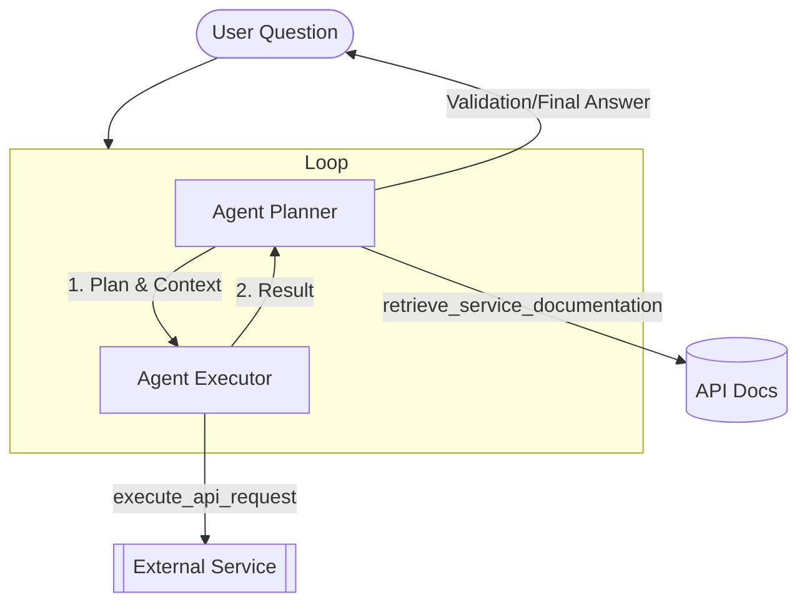

# Progressive Disclosure AI Agent

This agent system demonstrates the concept of **Progressive Disclosure** for solving complex, multi-step tasks using the Google ADK (Agent Development Kit).

## Design Concept
The core idea is to avoid overwhelming the LLM with a massive context (e.g., a full API specification) all at once. Instead, the system:
1.  **Decomposes** a complex task into smaller sub-tasks.
2.  **Discloses** only the relevant information (specific API documentation) needed for the *current* sub-task.
3.  **Iterates** through a loop to maintain focus, handle dependencies, and validate results at each step.

## Architecture
The system is built using a `LoopAgent` that coordinates two specialized sub-agents:

### 1. Agent Planner
- **Role**: Architect and Validator.
- **Responsibility**: Analyzes the goal, identifies the next sub-task, retrieves relevant documentation, and validates previous execution results.
- **Tool**: `retrieve_service_documentation` (Common tool).
- **Output**: `execution_context` (Plan + specific API spec).

### 2. Agent Executor
- **Role**: Atomic Operator.
- **Responsibility**: Performs a single API call based strictly on the planner's context.
- **Tool**: `execute_api_request` (Common tool).
- **Isolation**: Uses `include_contents="none"` to stay focused solely on the current task without history interference.

## Tech Stack
- **Framework**: [Google ADK](https://github.com/google/adk)
- **Model**: Gemini (configured via `common/ai_model.py`)
- **Tools**: Atomic Python functions for HTTP/JSON interaction located in `src/common/tools.py`.
- **Logic**: Iterative looping with state passing between Planner and Executor.

## Validation Logic
The system features a multi-layered validation approach:
- **Sub-task Validation**: After each loop, the Planner verifies if the last action was successful before proceeding.
- **Corrective Actions**: If an error is detected, the Planner can generate a corrective step (e.g., retrying or adjusting parameters).
- **Goal Verification**: A final check is performed once the sequence is complete to ensure the real-world state matches the user's intent.

## Test Question
To see the system in action, use the following complex task:

> **"Find the user named 'Charlie' and add him to the 'football' team."**

### Execution Flow for this Question:
1.  **Iteration 1**:
    - Planner: Fetches `/users` docs -> Context: "Find Charlie's ID".
    - Executor: Calls `GET /users` -> Result: `Charlie (ID: 3)`.
2.  **Iteration 2**:
    - Planner: Validates ID found -> Fetches `/teams` docs -> Context: "Add ID 3 to football team".
    - Executor: Calls `POST /teams/football/users/3` -> Result: `Success`.
3.  **Iteration 3**:
    - Planner: Validates success -> Finalizes result.
    - User: Receives confirmation.
