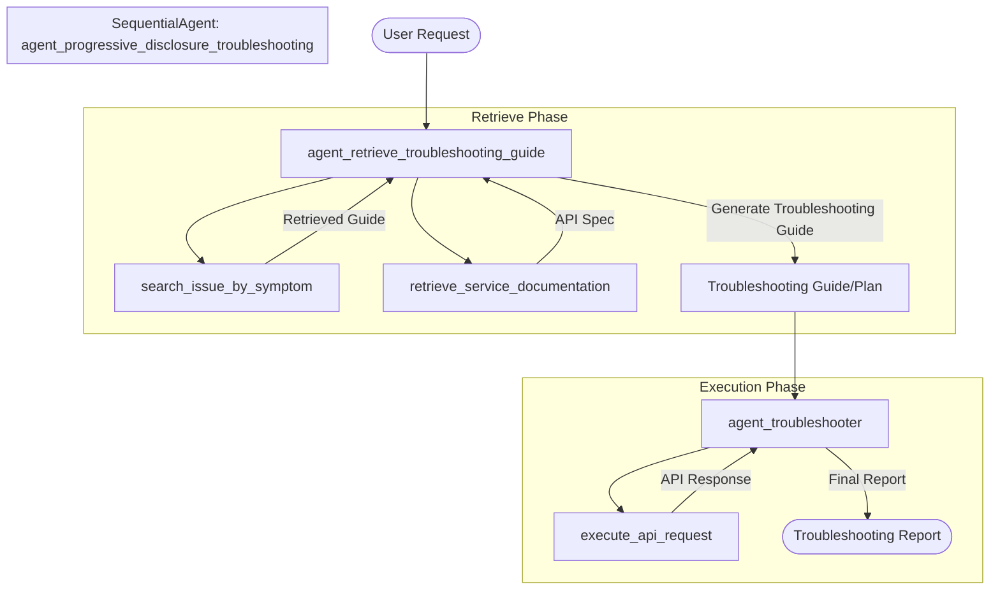

# Agent Progressive Disclosure Troubleshooting

This agent system is designed to automate the troubleshooting process for the `dummy-fastapi-service`. It follows a sequential process:

1.  **Retrieve Troubleshooting Guide**: The first agent, `agent_retrieve_troubleshooting_guide`, analyzes the user's issue, searches for a matching guide in a mock troubleshooting library, and retrieves the API documentation for the relevant service.
2.  **Troubleshoot**: The second agent, `agent_troubleshooter`, takes the generated troubleshooting plan and executes the necessary API calls to diagnose and resolve the issue.

## Workflow Diagram

## Components

-   **`agent_retrieve_troubleshooting_guide`**: 
    -   Analyzes user issue.
    -   Uses `search_issue_by_symptom` to find pre-defined guides.
    -   Uses `retrieve_service_documentation` to get API specs.
    -   Generates a tailored troubleshooting plan.
-   **`agent_troubleshooter`**: 
    -   Executes the plan step-by-step.
    -   Uses `execute_api_request` to interact with the service.
    -   Reports process and results.
-   **`agent_progressive_disclosure_troubleshooting`**: A `SequentialAgent` that orchestrates the workflow from retrieval to execution.

## Example Usage

**User Issue**: "Bob cannot join swim team."

The system will:
1.  Find the guide for "one user cannot join a team".
2.  Retrieve API specs for users and teams.
3.  Generate a plan to check user existence, team existence, and habit matching.
4.  Execute API calls to verify these conditions.
5.  Report the findings.
