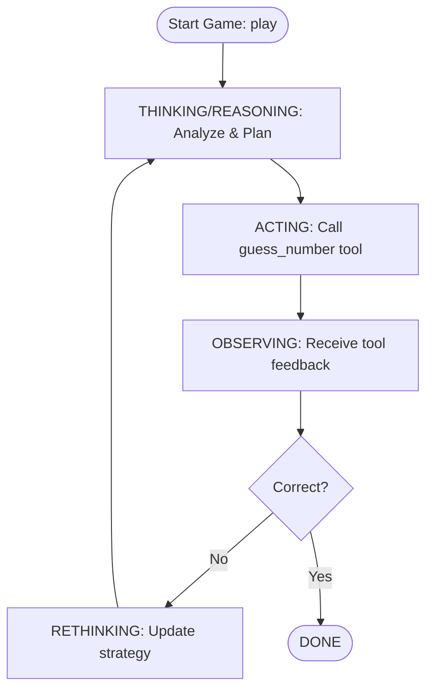

# NumberGuesser Agent

## Overview

The NumberGuesser Agent is a proof-of-concept implementation of a **ReAct (Reasoning + Acting)** agent powered by the Google ADK (Agent Development Kit).

## ReAct Agent Cycle

## How It Works

When a user says "play", the agent enters a **ReAct loop**:

1. **🧠 THINKING**: Analyzes the game state and plans the next guess
2. **⚡ ACTING**: Calls the `guess_number` tool with a guessed number
3. **👁️ OBSERVING**: Receives feedback (bigger/smaller/correct)
4. **🔄 RETHINKING**: Adjusts strategy based on the feedback
5. **🔁 ITERATION**: Repeats until the number is guessed correctly

## Agent Components

- **Model**: `gemini-3-flash-preview` - LLM for reasoning and decision-making
- **Tool**: `guess_number` - Validates guesses against a random number (0-100)
- **Instruction**: Guides the agent through the game flow

## ReAct Pattern Benefits

- **Transparency**: Track reasoning and actions step-by-step
- **Adaptability**: Adjust based on actual tool feedback
- **Correctness**: Real outcomes ground the agent's decisions
- **Effectiveness**: Iterative cycles solve tasks reliably

## Running the Agent

1. Start the ADK web server: `./start.sh`
2. Access: `http://127.0.0.1:8000`
3. Select `agent_react_number_guesser` from the agent list
4. Type "play" to start the game
5. Watch the agent think, act, observe, and rethink!
